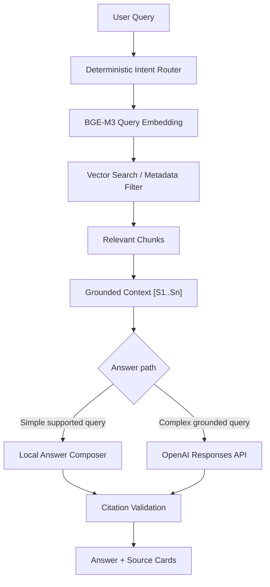
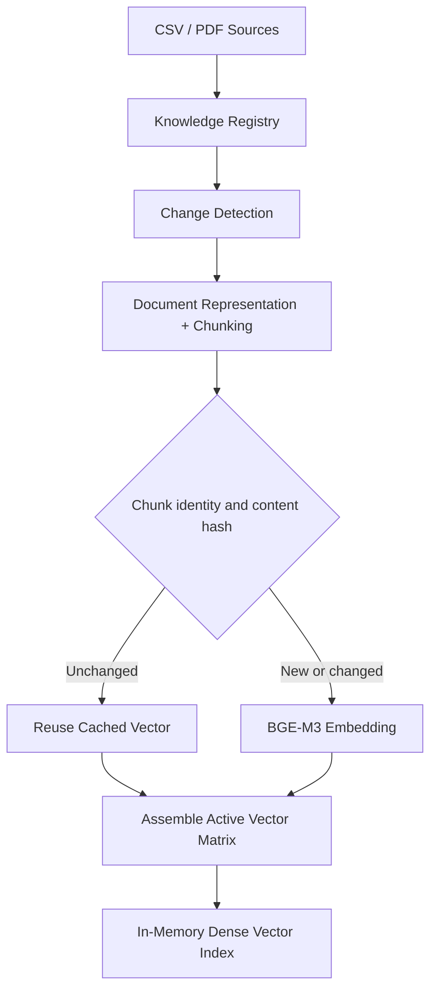

# FTMM Intelligent Academic Assistant

**Retrieval-Augmented Academic Information System for FTMM**

FTMM Intelligent Academic Assistant is an academic information retrieval system designed to make faculty knowledge easier to search, verify, and cite. Its knowledge base covers course information, lecturer profiles and research interests, academic procedures, faculty information, staff records, and extractable academic PDF documents.

The system separates retrieval, grounding, and generation. A query is first routed and matched against locally indexed evidence; retrieved chunks are then converted into a bounded context with deterministic source labels. Optional answer generation can use the OpenAI Responses API, while citation validation and no-answer controls keep the displayed response traceable to available evidence.

## Overview

Academic information often exists across heterogeneous CSV records, faculty pages, and PDF documents. A conventional keyword chatbot can miss multilingual or semantically related terms, while an unconstrained language model can produce claims that are not present in institutional sources.

This project addresses that gap with:

- multilingual dense retrieval using `BAAI/bge-m3`;
- intent-aware filtering for academic, course, lecturer, faculty, and staff queries;
- chunk-level traceability and deterministic source mapping;
- local PDF extraction with page-level provenance;
- grounded generation with citation and no-answer validation;
- incremental knowledge indexing that avoids recomputing unchanged vectors.

Knowledge ingestion, embedding, indexing, and retrieval run locally and do not require an OpenAI API key. OpenAI is an optional grounded generation layer rather than a dependency of the knowledge pipeline.

## Interface Preview

<!-- Add portfolio screenshot here: docs/images/ftmm-assistant-preview.png -->

The repository includes a static portfolio showcase under [`portfolio-demo/`](portfolio-demo/). It demonstrates the intended integrated application experience with mock data and does not connect to Flask, OpenAI, the embedding runtime, or any backend API.

Open [`portfolio-demo/index.html`](portfolio-demo/index.html) directly in a browser for the deterministic preview. Add `?screenshot=1` when serving the file through a local static server to disable distracting caret/loading presentation details.

## Features

- **Multilingual semantic retrieval**: dense semantic search over Indonesian and English academic terms.
- **BGE-M3 embeddings**: 1024-dimensional dense representations through FlagEmbedding.
- **Intent-aware retrieval**: deterministic query routing and metadata filters before vector search.
- **Structured knowledge representation**: stable parent and chunk identities for courses, lecturers, academic information, faculty records, staff, and PDFs.
- **PDF knowledge ingestion**: local extraction with one parent document per extractable page.
- **Page-level traceability**: PDF title, source identity, page number, and chunk identity are preserved through retrieval.
- **Grounding and citations**: answer-scoped `[S1]`, `[S2]`, and `[S3]` mappings connect claims to retrieved sources.
- **No-answer handling**: unsupported or insufficiently evidenced requests do not silently become generated facts.
- **Knowledge registry**: deterministic SHA-256 source versions with active, superseded, removed, and invalid states.
- **Incremental embedding reuse**: unchanged CSV and PDF chunks reuse valid cached vectors.
- **Chunk-addressable embedding cache**: persistent NPZ vectors with validated JSON identity/configuration mappings.
- **Optional OpenAI generation**: OpenAI Responses API with Structured Outputs is available for grounded answer composition.
- **Experimental retrieval paths**: native BGE-M3 sparse/hybrid retrieval and reranking remain isolated and disabled by default.
- **Offline knowledge processing**: source discovery, extraction, chunking, embedding, indexing, and evaluation can run without OpenAI.

## Architecture

### Query and answer path



Retrieval is always completed before optional generation. The model only receives bounded retrieved context, and factual output is checked against the available source labels before display.

### Knowledge ingestion and update path



Source files remain the source of truth. The registry records indexing metadata and version history but does not store embedding vectors or duplicate complete historical PDF text.

## Technology Stack

| Layer | Technology |
|---|---|
| Backend | Python, Flask, Flask-Session |
| Data processing | pandas, NumPy |
| Embedding | `BAAI/bge-m3` |
| Embedding runtime | FlagEmbedding / PyTorch |
| Retrieval | Dense cosine-similarity search with metadata filtering |
| Vector Search / Vector Database Layer | In-memory vector index + persistent incremental vector cache |
| Generation | OpenAI Responses API + Structured Outputs |
| PDF extraction | pypdf |
| Knowledge management | SHA-256 registry, source versioning, change detection |
| Frontend | HTML, CSS, JavaScript |
| Testing | Python `unittest` |

### Vector search layer

The current implementation uses an in-memory dense vector index backed by a persistent, chunk-addressable vector cache. It does **not** claim to use Pinecone, Qdrant, Chroma, Weaviate, FAISS, or another external vector database. The retrieval interface is separated from document preparation and embedding so that a dedicated vector database can be introduced later as corpus size and deployment requirements grow.

### OpenAI generation layer

The OpenAI Responses API is integrated as the optional grounded generation layer. Structured output, request budgeting, retry controls, evidence checks, and citation validation are handled around the provider call.

The following operations do not depend on OpenAI:

- CSV/PDF ingestion;
- document representation and chunking;
- BGE-M3 embedding;
- knowledge registry synchronization;
- dense vector indexing and retrieval;
- local/simple answer paths;
- retrieval and ingestion evaluation.

## Knowledge Pipeline

### Structured sources

Five structured datasets supply the baseline corpus:

- courses;
- lecturers;
- academic information;
- FTMM faculty information;
- faculty officers and staff.

Each row is converted into a semantic text representation without inventing absent fields. Stable metadata remains available for intent filtering, source cards, and citations.

### PDF sources

Extractable PDFs placed in `data/pdfs/` are processed locally. Each extractable page becomes one parent document, and chunks never cross page boundaries. Metadata includes the document title, source file, content hash, page range, parent ID, chunk ID, and token count.

PDF files are validated for size and extraction errors. Scanned image-only PDFs require OCR and are currently unsupported.

### Knowledge registry and versioning

The runtime registry is stored under `cache/knowledge/registry.json` and is ignored by Git. Logical source identity is distinct from content/version identity:

- same source and same hash → unchanged;
- same logical source with a new hash → old version superseded, new version active;
- source removed from discovery → removed from the active index;
- historical content restored → existing valid vectors reused;
- byte-identical duplicate → recorded without duplicating active knowledge;
- invalid PDF → isolated without discarding the healthy index.

Version IDs are derived from SHA-256 content hashes rather than timestamps. The registry is rebuildable from the source directory and structured repository.

## Grounding & Citations

Retrieved chunks are mapped to answer-scoped identifiers:

```text
Retrieved chunk
    ↓
Context label [S1]
    ↓
Inline answer citation
    ↓
Validated source card
```

The citation validator rejects unavailable source markers and unsupported source declarations. For PDFs, a source card retains the document title and page number. Retrieved content is treated as data rather than instruction, providing a boundary against prompt-like text inside source documents.

If no suitable evidence is available, the system returns a controlled no-answer result instead of fabricating an answer.

## Engineering Results

The following results come from the current development corpus and controlled evaluation fixtures.

| Metric | Result |
|---|---:|
| Parent documents | 391 |
| Indexed chunks | 566 |
| Embedding dimension | 1024 |
| Intent routing fixture | 52 / 52 correct |
| Routed Recall@1 / @3 / @5 / MRR | 0.9167 / 0.9167 / 0.9167 / 0.9167 |
| PDF retrieval Recall@1 | 1.00 |
| PDF retrieval Recall@3 / @5 / MRR | 1.00 / 1.00 / 1.00 |
| Incremental add vector reuse | 99.47% |
| Automated tests | 135 passed, 4 skipped |

> Metrics above were obtained from development and controlled evaluation fixtures and should not be interpreted as production-level guarantees.

### Incremental indexing benchmark

The controlled benchmark adds a synthetic three-page PDF to the existing 566-chunk corpus.

| Update | Reused | Embedded | Removed/replaced | Total time |
|---|---:|---:|---:|---:|
| Full rebuild (569 active chunks) | 0 | 569 | 0 | ~201.846 s |
| Add three-page PDF | 566 | 3 | 0 | ~14.817 s |
| Modify one PDF page | 568 | 1 | 1 | ~2.701 s |
| Delete PDF | 566 | 0 | 3 | ~1.630 s |
| Restore identical PDF | 569 | 0 | 0 | ~1.645 s |

The add scenario reuses 566 vectors and embeds only three new chunks (99.47% reuse). Modifying one page reuses 568 vectors and embeds one changed chunk (99.82% reuse). Incremental and clean rebuild paths produced the same Top-K chunk identities in the controlled comparison.

## Incremental Indexing

The vector cache uses a simple local format:

- compressed NPZ vector pool;
- JSON mapping from chunk ID and semantic-content hash to vector position;
- explicit model, dimension, precision, normalization, max-length, and chunking configuration;
- an active-record mapping used to assemble the current dense matrix.

Update behavior is intentionally conservative:

```text
Add source     → embed only new chunks
Modify source  → embed only changed semantic chunks
Delete source  → remove chunks from active matrix, no unnecessary embedding
Restore source → reuse historical vectors when model/config/content remain valid
```

Candidate cache files and the registry are written through temporary files, validated, and atomically replaced. A lightweight lock prevents concurrent local writers. Corrupt or configuration-incompatible caches fall back to an explicit full rebuild.

Use the local management CLI to inspect or update the knowledge index:

```powershell
python -m scripts.manage_knowledge_index --status
python -m scripts.manage_knowledge_index --dry-run
python -m scripts.manage_knowledge_index --sync
python -m scripts.manage_knowledge_index --rebuild
```

`--status` is read-only. `--dry-run` reports source changes and estimated vector reuse without writing registry/cache state or loading the embedding model; the tokenizer is still used to preserve deterministic chunk boundaries.

## Running Locally

### A. Backend application

Requirements:

- Python 3.10 or newer;
- enough local RAM for BGE-M3;
- internet access for the first model download, or a complete local Hugging Face snapshot;
- an OpenAI API key only when optional live generation is required.

Create the environment and install the repository dependencies:

```powershell
python -m venv .venv
.venv\Scripts\Activate.ps1
python -m pip install --upgrade pip
pip install -r requirements.txt
```

Copy `.env.example` to `.env`, configure the required local values, and start Flask:

```powershell
Copy-Item .env.example .env
python app.py
```

Open `http://127.0.0.1:5000`. Debug mode is disabled by default.

For offline BGE-M3 operation, point to a complete local model snapshot and prevent remote model resolution:

```powershell
$env:BGE_M3_LOCAL_PATH="C:\path\to\bge-m3\snapshot"
$env:HF_HUB_OFFLINE="1"
$env:TRANSFORMERS_OFFLINE="1"
python app.py
```

### B. Static portfolio showcase

No Python, Flask, model, API key, package install, or network connection is required. Open:

```text
portfolio-demo/index.html
```

For consistent local URL behavior, an optional standard-library static server can be used:

```powershell
python -m http.server 8080 --directory portfolio-demo
```

Then open `http://127.0.0.1:8080/?screenshot=1`. The showcase contains static mock responses and never calls the backend.

## Configuration

The main configuration is environment-driven. Secrets belong only in `.env`, which is ignored by Git.

```dotenv
OPENAI_API_KEY=
OPENAI_MODEL=gpt-4o-mini
FLASK_SECRET_KEY=
FLASK_DEBUG=false

EMBEDDING_BACKEND=bge-m3
BGE_M3_MODEL=BAAI/bge-m3
BGE_M3_LOCAL_PATH=
BGE_M3_DEVICE=cpu
BGE_M3_PRECISION=bf16
BGE_M3_BATCH_SIZE=1
BGE_M3_MAX_LENGTH=256

RETRIEVAL_MODE=dense
RETRIEVAL_TOP_K=10
RETRIEVAL_MIN_SCORE=0.5
INTENT_ROUTING_ENABLED=true

CHUNKING_ENABLED=true
CHUNK_MAX_TOKENS=200
CHUNK_OVERLAP_TOKENS=24

PDF_KNOWLEDGE_ENABLED=true
PDF_KNOWLEDGE_DIRECTORY=data/pdfs
PDF_MAX_FILE_MB=50

KNOWLEDGE_REGISTRY_PATH=cache/knowledge/registry.json
KNOWLEDGE_INCREMENTAL_INDEX=true

RERANKER_ENABLED=false
```

See [`.env.example`](.env.example) for the complete set of runtime options. Do not log, commit, or expose `OPENAI_API_KEY` or `FLASK_SECRET_KEY` to browser code.

## Testing

The normal test suite uses mocks for external services and does not require an OpenAI key:

```powershell
python -m unittest discover -s tests -v
python -m pip check
```

Model-heavy integration tests are opt-in through their documented environment flags. Retrieval evaluations can be run independently:

```powershell
python -m scripts.evaluate_retrieval --backend bge-m3
python -m scripts.evaluate_intent_routing
python -m scripts.evaluate_pdf_retrieval
python -m scripts.evaluate_incremental_indexing
```

## Project Structure

```text
Chatbot-FTMM/
├── app.py                         # Flask composition root
├── config.py                      # Environment-based settings
├── domain/                        # Documents, retrieval and chat models
├── repositories/                  # Structured and PDF knowledge sources
├── services/                      # Embedding, grounding, registry and LLM services
├── retrievers/                    # Dense and experimental hybrid retrieval
├── indexes/                       # In-memory dense/sparse indexes
├── data/
│   └── pdfs/                      # Optional local PDF knowledge directory
├── cache/                         # Ignored runtime registry and vector artifacts
├── templates/                     # Flask application templates
├── static/                        # Flask application assets
├── portfolio-demo/                # Static mock portfolio interface
├── scripts/                       # Evaluation and knowledge-management CLI
├── tests/                         # Unit and opt-in integration tests
├── requirements.txt
├── .env.example
└── README_TECHNICAL_BACKUP.md     # Preserved detailed technical documentation
```

## Current Limitations

- Live OpenAI generation requires valid API credentials; retrieval and local knowledge processing do not.
- A dedicated external vector database has not been deployed.
- OCR for scanned/image-only PDFs is not implemented.
- Complex PDF tables, multi-column layouts, and repeated headers/footers have limited extraction fidelity.
- An admin knowledge-upload interface is not connected.
- The reranker remains experimental because its CPU latency and memory cost are not suitable for the current default runtime.
- Lecturer retrieval is a weaker evaluation category than structured staff and course retrieval.
- The local JSON registry and file lock target a single-host deployment rather than distributed concurrent writers.
- The portfolio showcase is a static presentation layer and is not connected to the backend.

## Future Direction

Potential next engineering work includes:

- authenticated admin knowledge management;
- migration to a dedicated vector database for larger corpora and distributed deployment;
- OCR and stronger PDF layout parsing;
- conversational retrieval and controlled query rewriting;
- production observability and deployment hardening.

These items describe direction only and are not presented as completed capabilities.
